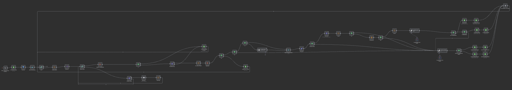

# Pipeline Generowania Cold Openerów ----(Scroll for English)----

**Trigger:** Ręczny (Batch run)

Ten workflow to "domykacz" (closer). Pobiera zakwalifikowane leady z poprzednich kroków i generuje hiper-spersonalizowane openery, oparte na "admin-empathy" (zrozumieniu bólu administracyjnego).

## Główna Logika: "Hierarchia Sygnałów"

Workflow opiera się na konkretnej filozofii: **Trafność > Reputacja**.
Nie traktuje wszystkich danych jednakowo. Używa logiki rozgałęziającej, aby znaleźć "najgłośniejszy" sygnał aktywności biznesowej.

1.  **Sygnał Podstawowy (Facebook):** Szuka *niedawnych* zmian operacyjnych (zatrudnienie, wydarzenia, zamknięcia, nowe technologie). Tworzą one natychmiastowy, ostry ból administracyjny.
2.  **Sygnał Wtórny (Opinie Google):** Jeśli brak niedawnej aktywności w socialach, system spada (fallback) do sygnałów *reputacji* (duża liczba opinii, konkretne pochwały). Sugerują one przewlekły ból administracyjny (popularność = duży ruch).

---

## Faza 1: Ponowna Weryfikacja i Link Intelligence

Przed wygenerowaniem tekstu, workflow upewnia się, że patrzy na właściwy ślad cyfrowy.

* **Wejście:** Czyta leady z CRM (Google Sheet), gdzie kolumna `Opener` jest pusta.
* **Ekstrakcja Linków:**
    * **Node:** `FB _LINK_EXTRACT`
    * **Logika:** Używa Regexa do wyciągnięcia potencjalnych linków do Facebooka z treści strony.
* **Inteligentne Rozróżnianie:**
    * **Node:** `FB_ANALYZER` (GPT-4-Nano)
    * **Zadanie:** Jeśli znaleziono wiele linków do FB (np. strona korporacyjna vs lokalna klinika), AI analizuje strukturę URL i nazwę kliniki, aby wybrać właściwą stronę *lokalną*.
* **Sprawdzenie Konkurencji:**
    * **Node:** `If5`
    * **Logika:** Skanuje URL lub dane strony pod kątem frazy "deardoc". Jeśli ją znajdzie, lead jest oflagowany/pominięty (prawdopodobnie korzystają już z konkurencji lub konkretnego vendora).

---

## Faza 2: "Inteligentne" Rozgałęzienie (The Fork)

Workflow dzieli się na dwie odrębne ścieżki w zależności od dostępności danych.

### Ścieżka A: "Aktywny Chaos" (Facebook)
**Trigger:** Znaleziono prawidłowy, unikalny link do Facebooka.

1.  **Głęboka Ekstrakcja:**
    * **Node:** `FB_POSTS` (Apify)
    * **Akcja:** Scrapuje posty z ostatnich ~4 miesięcy, w tym treść, daty i liczbę lajków.
2.  **Podsumowanie:**
    * **Node:** `Summarize2`
    * **Logika:** Łączy ostatnie posty w jeden blok tekstu, aby zmieścić się w oknie kontekstowym AI.
3.  **Generowanie:**
    * **Node:** `FACEBOOK_OPENER` (Gemini)
    * **Strategia:** "Znaczenie Operacyjne".

### Ścieżka B: "Dowód Społeczny" (Google)
**Trigger:** Brak linku do FB lub scrapowanie FB nie powiodło się/nie zwróciło nowych danych.

1.  **Źródło Danych:**
    * Wykorzystuje dane `Reviews` i `CleanedPage` zebrane w poprzednich workflow-ach.
2.  **Generowanie:**
    * **Node:** `GOOGLE_OPENER` (Gemini)
    * **Strategia:** "Wolumen i Motywy".

---

## Faza 3: Logika "Mostu" (Prompt Engineering)

To najbardziej krytyczna część workflow-u. Prompty są zaprojektowane tak, aby unikać generycznych komplementów ("Fajna strona!") i zamiast tego budować **Logiczny Most** do problemu, który rozwiązujesz (Przeciążenie Administracyjne).

### Strategia Promptowania Facebooka
* **Wejście:** Ostatnie posty o warsztatach, nowych pracownikach, przerwach świątecznych lub nowych technologiach.
* **Most:** AI otrzymuje instrukcję, że **Aktywność = Zapytania**.
    * *Jeśli zatrudnienie:* "Nowy personel oznacza więcej pytań o grafik od nowych pacjentów."
    * *Jeśli wydarzenia:* "Wydarzenia lokalne oznaczają więcej zapytań od osób niebędących pacjentami."
    * *Jeśli nowa technologia:* "Nowe usługi oznaczają więcej pytań o pokrycie ubezpieczeniowe."
* **Cel Wyjściowy:** "Widziałem, że niedawno dołączył do zespołu [Imię]. Większość właścicieli mówi mi, że taka faza wzrostu zazwyczaj podbija liczbę telefonów do recepcji z pytaniami o grafik."

### Strategia Promptowania Opinii Google
* **Wejście:** Duży wolumen 5-gwiazdkowych opinii wspominających o konkretnych rzeczach (np. "przyjazny personel", "terapia manualna").
* **Most:** AI otrzymuje instrukcję, że **Popularność = Hałas**.
    * *Duży wolumen:* "Świetna reputacja oznacza, że telefony się urywają."
    * *Pochwały personelu:* "Gdy pacjenci tak bardzo uwielbiają personel, dzwonią, by umówić się konkretnie do nich, tworząc Tetris w grafiku."
* **Cel Wyjściowy:** "Widziałem ogromną falę 5-gwiazdkowych opinii o waszej terapii manualnej. Zazwyczaj taki poziom popularności tworzy zator zapytań do obsłużenia przez recepcję."

---

## Faza 4: Kontrola Jakości i Routing

Workflow nie zapisuje ślepo każdego wyniku. Stosuje rygorystyczny filtr walidacyjny.

**Node Walidacyjny:** `FB IF OPENER BAD` / `IF ERROR/PASS`
Prompty AI mają instrukcję, by zwracać `PASS` lub `ERROR`, jeśli nie mogą znaleźć wystarczająco silnego sygnału.

* **Sukces:**
    * Wygenerowany opener jest czysty, ma poniżej 35 słów i ściśle trzyma się formatu.
    * **Akcja:** Aktualizuje arkusz `CRM` i kopiuje leada do arkusza `EXPORT_READY` dla narzędzia mailingowego.
* **Porażka (PASS/ERROR):**
    * AI nie mogło znaleźć mostu (np. nieaktywny Facebook, generyczne opinie).
    * **Akcja:** Aktualizuje `CRM` kodem błędu i przenosi leada do `VERIF_NEEDED` do ręcznego sprawdzenia.

---

## Podsumowanie Użytych Narzędzi

* **Apify:** Ciężka praca przy scrapowaniu Facebooka (obejście ścisłych zabezpieczeń anty-botowych).
* **GPT-4.1-Nano:** Tania logika do wybierania właściwego linku.
* **Google Gemini:** Wysokiej jakości kreatywne pisanie finalnych maili.
* **Regex:** Czyszczenie linków i markdowna.
* **Google Sheets:** Zarządzanie bazą danych i śledzenie stanu.

# Cold Opener Generation Pipeline

**Trigger:** Manual (Batch run)

This workflow is the "closer." It takes the qualified leads from the previous steps and generates hyper-personalized, "admin-empathy" cold email openers.

## The Core Logic: "Signal Hierarchy"

The workflow is built on a specific philosophy: **Relevancy > Reputation**.
It does not treat all data equally. It uses a branching logic to find the "loudest" signal of business activity.

1.  **Primary Signal (Facebook):** Looks for *recent* operational changes (hiring, events, closures, new tech). These create immediate, acute admin pain.
2.  **Secondary Signal (Google Reviews):** If no recent social activity exists, it falls back to *reputation* signals (high review volume, specific praise). These imply chronic admin pain (popularity = busyness).

---

## Phase 1: Re-Verification & Link Intelligence

Before generating text, the workflow ensures it is looking at the correct digital footprint.

* **Input:** Reads leads from the CRM (Google Sheet) where the `Opener` column is empty.
* **Link Extraction:**
    * **Node:** `FB _LINK_EXTRACT`
    * **Logic:** Uses Regex to pull potential Facebook links from the website body.
* **Intelligent Disambiguation:**
    * **Node:** `FB_ANALYZER` (GPT-4-Nano)
    * **Task:** If multiple Facebook links are found (e.g., a corporate page vs. a local clinic page), the AI analyzes the URL structure and clinic name to pick the correct *local* page.
* **Competitor Check:**
    * **Node:** `If5`
    * **Logic:** Scans for "deardoc" in the URL or page data. If found, the lead is flagged/skipped (likely because they are already using a competitor or specific vendor).

---

## Phase 2: The "Smart" Branching (The Fork)

The workflow splits into two distinct paths based on data availability.

### Path A: The "Active Chaos" Path (Facebook)
**Trigger:** A valid, unique Facebook link is found.

1.  **Deep Extraction:**
    * **Node:** `FB_POSTS` (Apify)
    * **Action:** Scrapes the last ~4 months of posts, including text, dates, and like counts.
2.  **Summarization:**
    * **Node:** `Summarize2`
    * **Logic:** Concatenates recent posts into a single text block to fit within the AI's context window.
3.  **Generation:**
    * **Node:** `FACEBOOK_OPENER` (Gemini)
    * **Strategy:** "Operational Significance."

### Path B: The "Social Proof" Path (Google)
**Trigger:** No Facebook link exists, or the Facebook scrape failed/returned no recent data.

1.  **Data Source:**
    * Uses the `Reviews` and `CleanedPage` data gathered in previous workflows.
2.  **Generation:**
    * **Node:** `GOOGLE_OPENER` (Gemini)
    * **Strategy:** "Volume & Themes."

---

## Phase 3: The "Bridge Logic" (Prompt Engineering)

This is the most critical part of the workflow. The prompts are designed to avoid generic compliments ("Nice website!") and instead build a **Logical Bridge** to the problem you are solving (Admin Overwhelm).

### The Facebook Prompt Strategy
* **The Input:** Recent posts about workshops, new staff, holiday closures, or new technology.
* **The Bridge:** The AI is instructed that **Activity = Inquiries**.
    * *If hiring:* "New staff means more new patient scheduling questions."
    * *If events:* "Community events mean more non-patient inquiries."
    * *If new tech:* "New services mean more questions about insurance coverage."
* **The Output Goal:** "Saw you recently added [Name] to the team. Most owners tell me that growth phase usually spikes the front-desk call volume with scheduling questions."

### The Google Review Prompt Strategy
* **The Input:** A high volume of 5-star reviews mentioning specific things (e.g., "friendly staff", "hands-on care").
* **The Bridge:** The AI is instructed that **Popularity = Noise**.
    * *High volume:* "Great reputation means the phone is ringing off the hook."
    * *Staff praise:* "When patients love the staff this much, they call specifically to book them, creating scheduling Tetris."
* **The Output Goal:** "Saw the massive wave of 5-star reviews about your hands-on care. Usually, that level of popularity creates a backlog of inquiries for the front desk to manage."

---

## Phase 4: Quality Control & Routing

The workflow does not blindly save every output. It uses a strict strict validation filter.

**Validation Node:** `FB IF OPENER BAD` / `IF ERROR/PASS`
The AI prompts are instructed to output `PASS` or `ERROR` if they cannot find a strong enough signal.

* **Success:**
    * The generated opener is clean, under 35 words, and strictly follows the format.
    * **Action:** Updates the `CRM` sheet and copies the lead to the `EXPORT_READY` sheet for the mailing tool.
* **Failure (PASS/ERROR):**
    * The AI couldn't find a bridge (e.g., inactive Facebook, generic reviews).
    * **Action:** Updates the `CRM` with the error code and moves the lead to `VERIF_NEEDED` for manual review.

---

## Summary of Tools Used

* **Apify:** Heavy lifting for Facebook scraping (bypassing strict anti-bot measures).
* **GPT-4.1-Nano:** Low-cost logic for picking the right link.
* **Google Gemini:** High-quality creative writing for the final emails.
* **Regex:** Cleaning links and markdown.
* **Google Sheets:** Database management and state tracking.