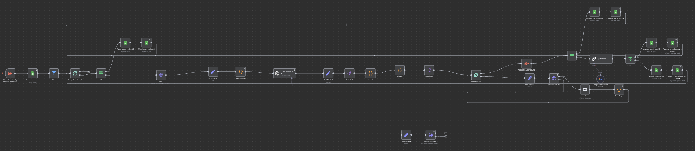

# Workflow Kwalifikacji i Wzbogacania Leadów ----Scroll for English----

**Nazwa Workflow:** `Qualifier`
**Trigger:** Uruchamiany przez workflow `Scraper-Sheets` (Sub-workflow).

Ten workflow działa jak "mózg" całej operacji. Pobiera surowe leady biznesowe, mapuje ich strony www, by znaleźć zakładki o zespole/o nas, scrapuje te konkretne podstrony i używa AI do ścisłej kwalifikacji biznesu oraz identyfikacji właściciela.

---

## Faza 1: Przygotowanie i Routing

**1. Źródło Wejściowe**
* **Node:** `Get row(s) in sheet`
* **Źródło:** Google Sheet `CRM`.
* **Logika:** Pobiera istniejące wiersze do przetworzenia.

**2. Filtrowanie**
* **Node:** `Filter`
* **Warunek:** Sprawdza, czy kolumna **"Clean Name"** jest `Pusta`.
* **Cel:** Zapewnia, że workflow przetwarza tylko nowe, niezweryfikowane leady, pomijając te już przeanalizowane.

**3. Walidacja Strony**
* **Node:** `If2`
* **Logika:** Sprawdza, czy pole `Company Website` istnieje.
    * **Brak Strony:** Aktualizuje wiersz wpisem "NO_WEBSITE" i zatrzymuje się.
    * **Strona Istnieje:** Przechodzi do Fazy 2.

---

## Faza 2: Zbieranie Wywiadu (Nawigacja)

Zamiast scrapować tylko stronę główną, ten workflow używa dwuetapowego procesu AI, aby znaleźć *właściwe* podstrony (np. "Poznaj Zespół" czy "O Nas").

### 1. Mapowanie Strony
* **Narzędzie:** `Firecrawl` (Self-hosted lub Cloud)
* **Endpoint:** `POST /v1/map`
* **Akcja:** Crawluje docelową domenę i zwraca listę WSZYSTKICH dostępnych adresów URL na stronie.

### 2. Inteligentna Selekcja Stron
* **Node:** `PAGE_SELECTOR`
* **Model:** OpenAI (alias `gpt-5-nano` w n8n)
* **Logika Promptu:**
    * Wejście: Lista wszystkich URL-i z Firecrawl.
    * Zadanie: Wybierz **Top 5** URL-i, które najprawdopodobniej zawierają info o właścicielu/personelu.
    * Zasady: Priorytetyzuj "About", "Team", "Staff", "Leadership". Ignoruj "Login", "Blog", "Contact".

---

## Faza 3: Głęboki Scraping i Czyszczenie

**1. Pętla Wykonawcza**
* **Node:** `Page By Page`
* **Akcja:** Iteruje przez 5 wybranych adresów URL.

**2. Ekstrakcja**
* **Node:** `SCRAPE PAGES`
* **Metoda:** HTTP GET z nagłówkami przeglądarki (User-Agent spoofing).
* **Konwersja:** Node `Markdown` konwertuje HTML na tekst.

**3. Czyszczenie**
* **Node:** `CleanPage` (Javascript)
* **Logika:** Używa Regexa do wycięcia menu nawigacyjnego, stopek, praw autorskich i linków do social mediów, aby zredukować zużycie tokenów i szum.

**4. Agregacja**
* **Node:** `WEBSITE_AGGREGATE`
* **Akcja:** Łączy wyczyszczony tekst ze wszystkich 5 stron w jeden blok kontekstowy.

---

## Faza 4: "Sędzia" (Analiza AI)

**Node:** `QUALIFIER`
**Model:** Google Gemini (`gemini-2.0-flash`)
**Temperatura:** `0.2` (Ścisła)

AI analizuje zagregowany tekst strony + opinie z Google Maps używając ścisłego skryptu walidacyjnego.

### Logika Walidacji
1.  **Twarde Dyskwalifikatory:**
    * Odrzuca: Vendorów, firmy konsultingowe, franczyzy i sieciówki (>15 lokalizacji).
2.  **Dominacja Sygnału:**
    * Upewnia się, że słowa kluczowe "Fizjoterapia" przeważają nad ogólnymi "Terapia" (np. logopedia, terapia zajęciowa).
3.  **Identyfikacja Właściciela:**
    * Skanuje w poszukiwaniu "Owner", "Founder", "CEO".
    * **Cross-Reference:** Sprawdza, czy nazwiska wspomniane w opiniach (np. "Dr Smith jest super") pasują do nazwisk znalezionych na stronie.

### Wyjścia (Outputs)
* **Sukces:** Zwraca **Imię i Nazwisko Właściciela** (np. "Sarah Johnson").
* **Porażka (SKIP):** Zwraca ustandaryzowany powód odrzucenia:
    * `SKIP: Chain clinic`
    * `SKIP: Insufficient depth in physical therapy services`
    * `SKIP: Cannot verify owner from website data`

---

## Faza 5: Routing i Storage

Workflow kieruje wynik do różnych arkuszy w oparciu o decyzję AI.

**Node Decyzyjny:** `If1` (Sprawdza, czy wynik zaczyna się od "SKIP")

| Wynik | Arkusz Docelowy | Zapisane Dane |
| :--- | :--- | :--- |
| **Zakwalifikowany** | `THE QUALIFIER` | Imię Właściciela, Strona, Opinie, Miasto, Kraj |
| **Zdyskwalifikowany** | `VERIF_NEEDED` | Powód SKIP, Strona, Opinie |
| **Aktualizacja Statusu** | `CRM` (Arkusz Główny) | Aktualizuje główną listę wynikiem, aby zapobiec ponownemu przetwarzaniu. |

# Lead Qualification & Enrichment Workflow

**Workflow Name:** `Qualifier`
**Trigger:** Executed by the `Scraper-Sheets` workflow (Sub-workflow).

This workflow acts as the "brain" of the operation. It takes raw business leads, maps their websites to find staff/about pages, scrapes those specific pages, and uses AI to strictly qualify the business and identify the owner.

---

## Phase 1: Preparation & Routing

**1. Input Source**
* **Node:** `Get row(s) in sheet`
* **Source:** Google Sheet `CRM`.
* **Logic:** Fetches existing rows to process.

**2. Filtering**
* **Node:** `Filter`
* **Condition:** Checks if the column **"Clean Name"** is `Empty`.
* **Purpose:** Ensures the workflow only processes new, unverified leads, skipping those already analyzed.

**3. Website Validation**
* **Node:** `If2`
* **Logic:** Checks if the `Company Website` field exists.
    * **No Website:** Updates the row with "NO_WEBSITE" and stops.
    * **Has Website:** Proceeds to Phase 2.

---

## Phase 2: Intelligence Gathering (Navigation)

Instead of scraping just the homepage, this workflow uses a two-step AI process to find the *right* pages (e.g., "Meet the Team" or "About Us").

### 1. Site Mapping
* **Tool:** `Firecrawl` (Self-hosted or Cloud)
* **Endpoint:** `POST /v1/map`
* **Action:** Crawls the target domain and returns a list of ALL accessible URLs on the site.

### 2. Intelligent Page Selection
* **Node:** `PAGE_SELECTOR`
* **Model:** OpenAI (`gpt-5-nano` alias in n8n)
* **Prompt Logic:**
    * Input: List of all URLs from Firecrawl.
    * Task: Select **Top 5** URLs most likely to contain owner/staff info.
    * Rules: Prioritize "About", "Team", "Staff", "Leadership". Ignore "Login", "Blog", "Contact".

---

## Phase 3: Deep Scraping & Cleaning

**1. Execution Loop**
* **Node:** `Page By Page`
* **Action:** Iterates through the 5 selected URLs.

**2. Extraction**
* **Node:** `SCRAPE PAGES`
* **Method:** HTTP GET with browser headers (User-Agent spoofing).
* **Conversion:** `Markdown` node converts HTML to text.

**3. Cleaning**
* **Node:** `CleanPage` (Javascript)
* **Logic:** Uses Regex to strip navigation menus, footers, copyright text, and social media links to reduce token usage and noise.

**4. Aggregation**
* **Node:** `WEBSITE_AGGREGATE`
* **Action:** Combines the cleaned text from all 5 pages into a single context block.

---

## Phase 4: The "Judge" (AI Analysis)

**Node:** `QUALIFIER`
**Model:** Google Gemini (`gemini-2.0-flash`)
**Temperature:** `0.2` (Strict)

The AI analyzes the aggregated website text + Google Maps reviews using a strict validation script.

### Validation Logic
1.  **Hard Disqualifiers:**
    * Rejects: Vendors, consulting firms, franchises, and chains (>15 locations).
2.  **Signal Dominance:**
    * Ensures "Physical Therapy" keywords outnumber generic "Therapy" keywords (e.g., Speech, Occupational).
3.  **Owner Identification:**
    * Scans for "Owner", "Founder", "CEO".
    * **Cross-Reference:** Checks if names mentioned in reviews (e.g., "Dr. Smith is great") match names found on the website.

### Outputs
* **Success:** Returns the **Owner's Name** (e.g., "Sarah Johnson").
* **Failure (SKIP):** Returns a standardized rejection reason:
    * `SKIP: Chain clinic`
    * `SKIP: Insufficient depth in physical therapy services`
    * `SKIP: Cannot verify owner from website data`

---

## Phase 5: Routing & Storage

The workflow routes the result to different sheets based on the AI's decision.

**Decision Node:** `If1` (Checks if result starts with "SKIP")

| Outcome | Destination Sheet | Data Recorded |
| :--- | :--- | :--- |
| **Qualified** | `THE QUALIFIER` | Owner Name, Website, Reviews, City, Country |
| **Disqualified** | `VERIF_NEEDED` | The SKIP reason, Website, Reviews |
| **Status Update** | `CRM` (Main Sheet) | Updates the main list with the finding to prevent re-processing. |