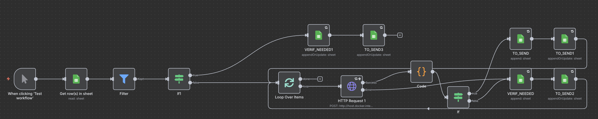

# Scraper & Filter Workflow (Scraper_Sheets)

First stage of the n8n pipeline. Ingests raw Google Maps output from a Dockerized scraper, drops anything that obviously isn't a lead, trims review payloads down to what the later stages actually use, appends survivors to the CRM sheet, and hands control to the qualifier workflow.

Sanitized public extract of a private project. Commit history lives in the private source repo.

---

## Scope & status

Part of a three-workflow n8n pipeline, self-hosted on Docker. This is the cheap upfront stage: no LLM calls, no external APIs beyond the Sheets write. All logic is regex, JSON parsing, and three filter conditions. Ran in production on real lead batches long enough to validate the pipeline end-to-end.

---

## Why this is the first stage

The two workflows downstream spend real money — Firecrawl calls, OpenAI routing, Gemini qualification and generation, Apify for Facebook. If every Google Maps row reached them, the per-batch bill would be absurd and most of the spend would be wasted on leads that fail at the first obvious check.

The rule is: cheap logic first, expensive logic only on rows that survive. The filters here are deliberately dumb — no model, no judgement, just three hard gates.

---

## Architecture

1. **Scraper (external):** `gosom/google-maps-scraper` runs in its own Docker container for a given query/region. It writes newline-delimited JSON (JSONL) to a shared volume.
2. **Ingest:** n8n's `Read/Write Files from Disk` node picks up the JSONL file; `Extract from File` parses it line by line.
3. **Hard filter:** a `Filter` node drops any row where:
   - `website` is empty (nothing to qualify without one)
   - `rating` is below 4.0 (too little signal to justify the later LLM spend)
   - `status` is `Closed` (obvious)
4. **Review trim:** the scraper returns full review objects (author name, text, photos, language, translation flags, avatar URLs, etc.). A `Code` node strips each review down to name + text only. That's all the qualifier and email generator ever look at, and keeping the rest would balloon token usage two stages later.
5. **Append:** surviving rows are written to the `CRM` tab in Google Sheets. This sheet is the shared state for the whole pipeline.
6. **Handoff:** an `Execute Workflow` node triggers the qualifier as a sub-workflow on the fresh rows.

---

## Why Google Sheets and not a real database

Three workflows need to read and write the same rows, and the non-technical side of this project (me eyeballing pipeline state, spot-checking rejected leads, exporting to the mailing tool) benefits from having the data in a spreadsheet. Sheets gives me shared state with zero infra to maintain.

Tradeoffs accepted: no transactions, no indexes, fragile schema, Sheets API rate limits. It works because volume is in the hundreds-of-leads-per-batch range, not millions. If that changed I'd move to Postgres.

---

## Why the Google Maps scraper runs outside n8n

`gosom/google-maps-scraper` is a standalone Go binary. Wrapping it as a custom n8n node would mean writing and maintaining that node. Running it as its own container and exchanging data via a shared file is boring, works, and keeps the n8n export portable between machines.

Slightly awkward file-based handoff, much simpler failure modes.

---

## What's deliberately not here

- No retry logic on the scraper — if it fails I re-run it by hand
- No deduplication at this stage (the qualifier's `Clean Name is empty` filter handles this implicitly)
- No rate limiting on the Sheets write — batch sizes are small enough that it hasn't been an issue
- No automated tests — verified by running against real and synthetic input and reading the output

---

---

# 🇵🇱 Wersja polska

Pierwszy etap pipeline'u n8n. Pobiera surowy output z Dockerowego scrapera Google Maps, wyrzuca oczywiste nie-leady, przycina payloady recenzji do tego, co faktycznie zostanie wykorzystane, zapisuje pozostałe do arkusza CRM i przekazuje sterowanie do workflow kwalifikującego.

## Po co to pierwsze

Kolejne dwa workflow kosztują — Firecrawl, OpenAI, Gemini, Apify. Gdyby trafiał tam każdy rekord z Google Maps, większość tego budżetu szłaby na leady, które i tak odpadną przy oczywistych filtrach. Stąd zasada: najpierw tania logika, a koszty tylko na tym, co przeszło.

## Jak to działa

`gosom/google-maps-scraper` w osobnym kontenerze zapisuje JSONL na wspólny wolumen → n8n parsuje plik linia po linii → filtr odrzuca rekordy bez strony, z oceną poniżej 4.0 albo ze statusem "Closed" → `Code` node przycina recenzje do pól `name + text` (żeby ograniczyć koszt tokenów dwa etapy później) → ocalałe leady trafiają do arkusza `CRM` → `Execute Workflow` uruchamia qualifier.

## Stack

n8n (self-hosted, Docker) · `gosom/google-maps-scraper` (Docker) · Google Sheets

## License

Source-available for reference. Not licensed for redistribution or commercial use.
